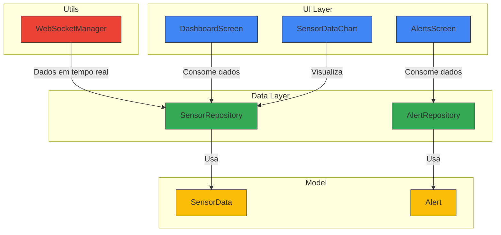

# Arquitetura do Aplicativo Potato para Smartwatch

## Descrição da Arquitetura

### Camadas

- **UI Layer**: Componentes de interface do usuário
    - DashboardScreen: Tela principal que exibe os dados dos sensores
    - AlertsScreen: Tela que mostra alertas e notificações
    - SensorDataChart: Componente para visualização gráfica dos dados

- **Data Layer**: Gerenciamento e acesso aos dados
    - SensorRepository: Gerencia os dados dos sensores
    - AlertRepository: Gerencia os alertas e notificações

- **Model**: Estruturas de dados
    - SensorData: Modelo para os dados dos sensores
    - Alert: Modelo para alertas

- **Utils**: Utilitários e serviços
    - WebSocketManager: Gerencia a comunicação em tempo real

### Fluxo de Dados

1. O WebSocketManager recebe dados em tempo real e os envia para o SensorRepository
2. Os repositórios (SensorRepository e AlertRepository) utilizam os modelos para estruturar os dados
3. Os componentes de UI consomem dados dos repositórios para exibição
4. O SensorDataChart visualiza os dados do SensorRepository em formato gráfico

Esta arquitetura segue um padrão em camadas, separando claramente as responsabilidades entre interface do usuário, gerenciamento de dados e modelos de dados.